# ECBT Platform

**企业级 RWA（Real World Asset）代币化平台**

将真实世界资产（房地产、债券、大宗商品等）代币化，支持灵活分红、二级市场交易和自动化清算。

---

## 技术栈

| 层级 | 技术 |
|------|------|
| 智能合约 | Solidity 0.8.20, Hardhat, OpenZeppelin |
| 前端 | Next.js 14, React 18, TailwindCSS, RainbowKit, wagmi |
| 区块链 | Ethereum (Sepolia 测试网) |
| 索引 | The Graph (子图) |

---

## 项目结构

```
ECBT-main/
├── contracts/              # 智能合约
│   ├── AssetToken.sol      # 资产代币（ERC20）
│   ├── CollateralVault.sol # 抵押金库
│   ├── OrderBook.sol       # 订单簿（二级市场）
│   ├── RevenueManager.sol  # 收益管理
│   ├── LiquidateManager.sol# 清算管理
│   └── interfaces/         # 接口定义
├── frontend/               # Next.js 前端应用
├── test/                   # 合约测试
├── scripts/                # 部署和工具脚本
├── graph/                  # The Graph 子图
├── revenueUpdater/         # 收益数据更新服务
└── docs/                   # 文档
```

---

## 核心合约

| 合约 | 功能 |
|------|------|
| **AssetToken** | RWA 资产代币，支持合规转账、分红计算、份额冻结 |
| **CollateralVault** | 抵押金库，管理募集资金和收益存储 |
| **OrderBook** | 二级市场订单簿，支持挂单/买入/取消 |
| **RevenueManager** | 收益管理，记录每日收益并计算分红 |
| **LiquidateManager** | 清算管理，处理资产不达标时的清算分配 |

### 合约架构图

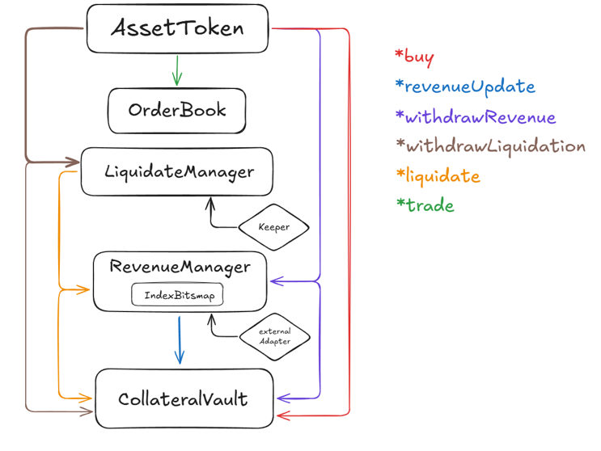

---

## 主要功能

- ✅ **资产代币化** - 将 RWA 资产发行为 ERC20 代币
- ✅ **一级市场购买** - 投资者使用 USDT 购买资产份额
- ✅ **二级市场交易** - 订单簿模式支持挂单和买入
- ✅ **收益分红** - 按持有时间和份额自动计算分红
- ✅ **清算机制** - 资产不达标时的自动清算分配

---

## 技术实现难点

### 1. 时间敏感的分红计算

**问题**：用户在不同时间购买份额，每笔份额的分红起点不同，需要精确追踪每份额的持有时间。

**解决方案**：
- 每个用户维护 `HolderInfo[]` 数组，记录多笔购买的独立份额
- 每笔份额独立记录 `holdingStartTime` 和 `lastDividendTime`
- 提取分红时遍历所有份额，分别计算后合并

```solidity
struct HolderInfo {
    uint256 shares;              // 持有份额
    uint256 holdingStartTime;    // 持有开始时间
    uint256 lastDividendTime;    // 上次分红时间
    uint256 lastLiquidationClaimTime;
}
mapping(address => HolderInfo[]) public holderInfo;
```

**收益更新流程**：


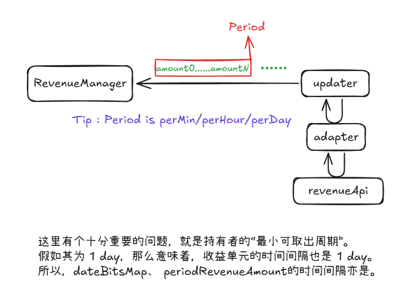

**位图与映射存储**：


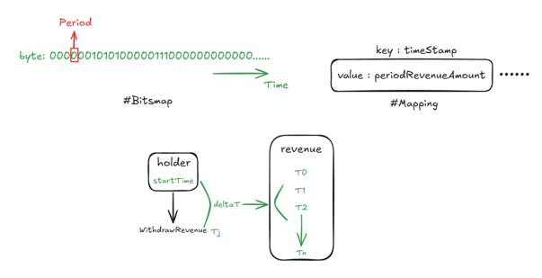

**位图查询示例**：


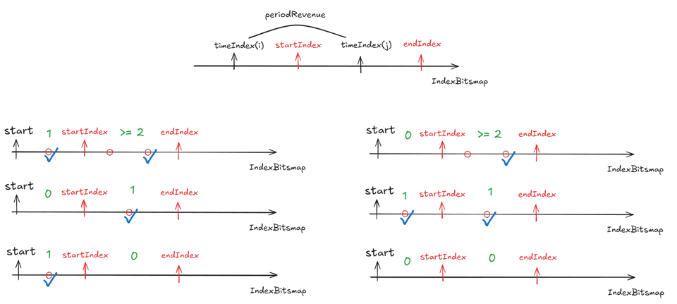

**分红计算时间线**：


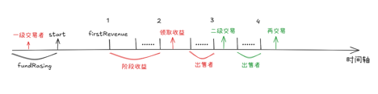

### 2. 位图索引优化 Gas 消耗

**问题**：收益按时间记录，查询历史收益需要遍历大量时间点，Gas 消耗高。

**解决方案**：
- 使用 `IndexBitmap` 库，每个 bit 代表一个时间索引
- 单个 `uint256` 可存储 256 个时间点标记
- 支持高效的范围查询：`findMinMarked`、`findMaxMarked`

```solidity
library IndexBitmap {
    uint256 internal constant BITS_PER_SLOT = 256;
    
    function set(mapping(uint256 => uint256) storage bitmap, uint256 index) internal {
        uint256 slotIndex = index / BITS_PER_SLOT;
        uint256 bitPosition = index % BITS_PER_SLOT;
        bitmap[slotIndex] |= (1 << bitPosition);
    }
}
```

### 3. 二级市场与分红权益同步

**问题**：卖方挂单后，份额仍在其账户，但不应继续获得分红；买方成交后需要从正确时间点开始计算分红。

**解决方案**：
- 挂单前强制提取所有分红，合并份额为单一记录
- 订单记录 `lastDividendTime`，成交时转移给买方
- 使用 `frozenAmounts` 冻结挂单份额，防止重复出售

```solidity
function sellShares(uint256 amount, uint256 price, address recipient) external {
    // 1. 先提取分红，合并所有份额
    withdrawDividend(recipient, msg.sender);
    
    // 2. 冻结待售份额
    frozenAmounts[msg.sender] += amount;
    
    // 3. 创建订单，记录当前分红时间
    orderBook.createSellOrder(msg.sender, amount, price, lastDividendTime, ...);
}
```

### 4. 分批清算机制

**问题**：资产收益不达标时需要清算抵押金，但一次性清算可能造成市场冲击。

**解决方案**：
- 季度检查收益是否达标
- 不达标时每次清算 20% 抵押金
- 记录清算时间数组，用于按份额计算可领取的清算金

```solidity
function checkQuarterlyRevenue() external returns (bool meetsExpectation) {
    // 比对实际收益与预期
    if (!meetsExpectation) {
        // 增加 20% 可清算额度
        collateralVault.updateLiquidatableCollateral(2000); // 20% in basis points
        liquidationTimes.push(block.timestamp);
        liquidationCount++;
    }
}
```

**收益周期**：

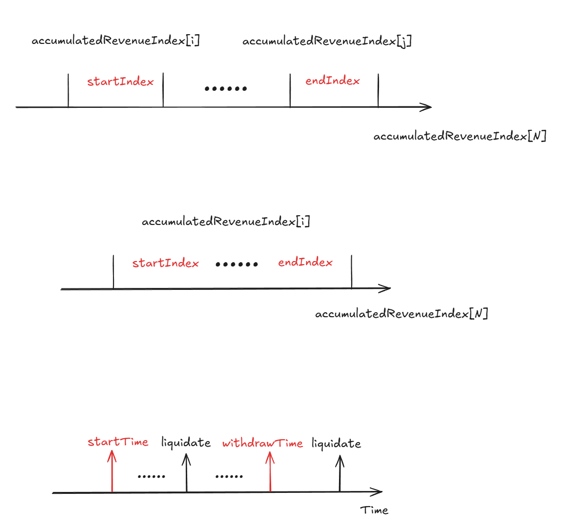

**清算周期**：


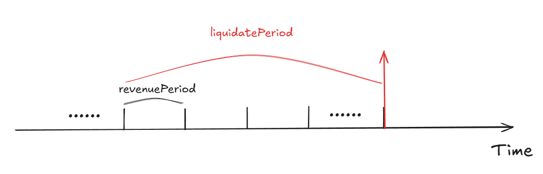

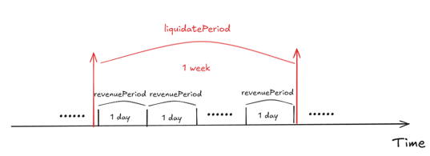

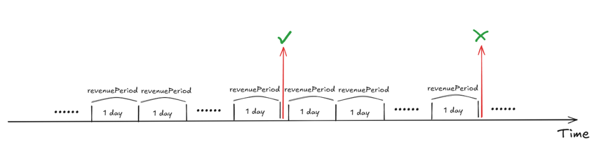


### 5. 时间截断与精度处理

**问题**：区块时间戳精确到秒，但收益通常按天/周记录，需要对齐时间边界。

**解决方案**：
- 支持多种时间单位：分钟、小时、天、周
- 统一使用截断后的时间戳作为索引
- 累计收益模型避免精度损失

```solidity
function truncateTimestampBySeconds(uint256 timestamp) public view returns (uint256) {
    return timestamp - (timestamp % unitSeconds); // unitSeconds = 86400 for daily
}
```

### 6. 合约间状态一致性

**问题**：5 个核心合约相互依赖，状态更新需要保持原子性和一致性。

**解决方案**：
- 明确的调用层次：`AssetToken` → `OrderBook`/`RevenueManager`/`CollateralVault`
- 关键操作使用事务模式，失败则全部回滚
- 接口隔离，通过接口定义合约交互边界

```
AssetToken (业务入口)
    ├── CollateralVault (资金管理)
    ├── RevenueManager (收益记录)
    ├── OrderBook (订单管理)
    └── LiquidateManager (清算控制)
```
**分红提取**：

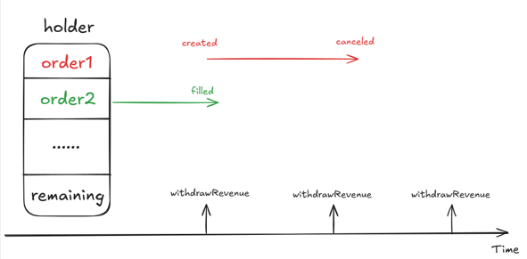

**份额组合**：


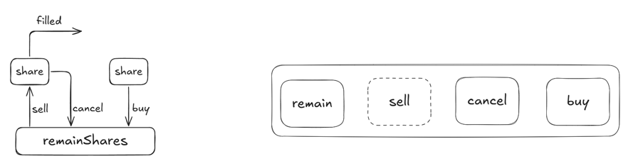

---

## 测试网信息

- **网络**: Sepolia Testnet
- **Chain ID**: 11155111
- **部署信息**: 查看 `deployment-info-sepolia.json`

---
## 快速开始

### 环境准备

- Node.js >= 18
- npm 或 yarn

### 安装依赖

```bash
# 安装合约依赖
npm install

# 安装前端依赖
cd frontend && npm install
```

### 编译合约

```bash
npm run compile
```

### 运行测试

```bash
npm test
```

### 本地节点

```bash
npm run node
```

### 部署到 Sepolia

1. 配置环境变量：

```bash
cp env.tmp .env
# 编辑 .env 填入 SEPOLIA_RPC_URL 和 PRIVATE_KEY
```

2. 部署合约：

```bash
npx hardhat run scripts/deploy-sepolia.js --network sepolia
```

---

## 前端运行

```bash
cd frontend

# 配置环境变量
cp env.example .env.local
# 编辑 .env.local 填入合约地址

# 启动开发服务器
npm run dev
```

访问 http://localhost:3000

---


